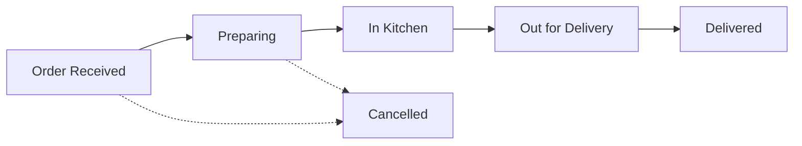

# 🍕 Pizzario – Full Stack Pizza Delivery & Order Management Platform

[](https://oibsip-web-dev-l3-pizza-delivery-wa-one.vercel.app/)
[](https://oibsip-webdev-l3-pizzadelivery.onrender.com/api)
[](https://react.dev/)
[](https://tailwindcss.com/)
[](https://nodejs.org/)
[](https://expressjs.com/)
[](https://www.mongodb.com/)

**Pizzario** is a full-stack pizza ordering, live kitchen dispatch, real-time delivery tracking, and restaurant administration platform built with the **MERN Stack** (MongoDB Atlas, Express.js, React 19, Node.js).

Developed as part of the **OASIS Infobyte Web Development and Designing Internship (OIBSIP Level 3)** by **Sourabh Patel**.

---

## 🌐 Live Deployments & Links

- 🚀 **Live Frontend Application**: [https://oibsip-web-dev-l3-pizza-delivery-wa-one.vercel.app](https://oibsip-web-dev-l3-pizza-delivery-wa-one.vercel.app/)
- ⚙️ **Live Backend API**: [https://oibsip-webdev-l3-pizzadelivery.onrender.com/api](https://oibsip-webdev-l3-pizzadelivery.onrender.com/api)
- 📦 **GitHub Repository**: [https://github.com/Sourabh123-atl/OIBSIP-WebDev-L3-PizzaDelivery-](https://github.com/Sourabh123-atl/OIBSIP-WebDev-L3-PizzaDelivery-)

---

## 🔑 Authentication & Login Portals

User and Admin authentication flows are **completely separated** for maximum security and role isolation:

| Portal | Route | Intended Users | Test Credentials |
| :--- | :--- | :--- | :--- |
| **Customer Portal** | [`/login`](https://oibsip-web-dev-l3-pizza-delivery-wa-one.vercel.app/login) | Customers only | `proshani548@gmail.com` / `password123`<br>*(or register a new account)* |
| **Admin Portal** | [`/admin/login`](https://oibsip-web-dev-l3-pizza-delivery-wa-one.vercel.app/admin/login) | Store Managers / Admins only | `admin@pizzario.com` / `admin123` |

> [!NOTE]
> - All login inputs are **empty by default** (no hardcoded credentials or auto-fills in the UI).
> - Customer login only allows normal customers and redirects to customer home/dashboard.
> - Admin login has dedicated verification requiring `role === 'admin'`.

---

## 🌟 Core Features

### 👤 Customer Experience
- **Interactive Menu**: Explore items categorized across *Pizzas, Burgers, Pastas, Sides, Drinks, and Desserts* with live search and favorites.
- **Cart & Coupon Engine**: Full state management with localStorage persistence. Apply coupon code `PIZZA20` for 20% discount, live calculation of subtotal, tax, and delivery charges.
- **Secure Checkout**: Enter recipient name, contact number, delivery address, instructions, and choose payment mode (*Cash on Delivery, Credit/Debit Card, UPI*).
- **Live 5-Stage Order Tracking**: Visual step progression (*Order Received ➔ Preparing ➔ In Kitchen ➔ Out for Delivery ➔ Delivered*) with 8-second polling and manual refresh.
- **Order History (`/my-orders`)**: Review all past orders, items, payment statuses, timestamps, and open live trackers.
- **Account Management**: Customer registration, secure login with bcrypt password hashing, JWT token authentication, and password reset workflows.

### ⚡ Restaurant Administration Console (`/admin`)
- **Executive Analytics Dashboard**: Live metrics for Total Revenue, Total Orders, Active Kitchen Orders, Menu Products Count, and Registered Customers.
- **Real-Time Order Dispatch & Status Control (`/admin/orders`)**:
  - Live customer orders loaded directly from MongoDB Atlas.
  - Filter orders by status: *All, Order Received, Preparing, In Kitchen, Out for Delivery, Delivered, Cancelled*.
  - Update kitchen/delivery status with immediate reflection in the customer's live tracker.
- **Menu & Product Management (`/admin/menu`)**:
  - Create new menu items with image, category, description, and pricing.
  - Edit existing items, adjust pricing, and toggle stock availability.
  - Delete discontinued products.
- **User & Role Management (`/admin/users`)**: Inspect registered customer accounts and toggle admin permissions.
- **Route Guard Protection (`ProtectedRoute`)**: Unauthenticated users are redirected to `/login`, and non-admin users attempting to access `/admin/*` are prompted to sign in via `/admin/login`.

---

## 🔄 Real-Time Order Lifecycle



1. **Customer places order** at `/checkout` ➔ saved to MongoDB Atlas database.
2. **Order appears instantly** in Admin Orders Console (`/admin/orders`) and Dashboard (`/admin/dashboard`).
3. **Admin / Kitchen updates status** (e.g. `Order Received` ➔ `Preparing` ➔ `Out for Delivery`).
4. **Customer observes real-time progress** on the Live Order Tracking timeline (`/order-tracking/:id`).

---

## 🛠️ Technology Stack

### Frontend
- **Framework**: React 19 + Vite 8
- **Styling**: Tailwind CSS v4 + Vanilla CSS animations & glassmorphism
- **Routing**: React Router DOM v7
- **Icons**: React Icons (FontAwesome)
- **Notifications**: React Toastify

### Backend
- **Runtime**: Node.js & Express 5
- **Database**: MongoDB Atlas Cloud + Mongoose ODM (with resilient in-memory fallback)
- **Security**: JSON Web Tokens (JWT), bcrypt password hashing, CORS protection
- **Architecture**: Clean MVC architecture (Controllers, Models, Routes, Middleware)

---

## 📂 Project Structure

```text
OIBSIP-WebDev-L3-PizzaDelivery
│
├── client/                     # Frontend Application (React + Vite)
│   ├── src/
│   │   ├── assets/             # Pizza & product image assets
│   │   ├── components/         # Navbar, Footer, PizzaCard, Hero, ProtectedRoute
│   │   ├── config/             # Dynamic API URL resolution (Local vs Render)
│   │   ├── context/            # AuthContext & CartContext (Global state)
│   │   ├── pages/
│   │   │   ├── Home/           # Landing page
│   │   │   ├── Menu/           # Filterable food menu
│   │   │   ├── Cart/           # Shopping cart & coupon discount
│   │   │   ├── Checkout/       # Checkout & delivery address
│   │   │   ├── MyOrders/       # Customer order history
│   │   │   ├── OrderTracking/  # Real-time 5-stage order tracker
│   │   │   ├── Login/          # Customer-only login
│   │   │   ├── Register/       # Customer account creation
│   │   │   ├── ForgotPassword/ # Password reset request
│   │   │   ├── ResetPassword/  # Password reset confirmation
│   │   │   └── Admin/          # AdminLogin, AdminDashboard, AdminOrders, AdminMenu, AdminUsers
│   │   ├── App.jsx             # Route definitions & layout wrappers
│   │   └── main.jsx            # React root mount
│   ├── vercel.json             # Vercel SPA routing & API proxy rewrite
│   ├── vite.config.js
│   └── package.json
│
├── server/                     # Backend API (Express + Node + MongoDB)
│   ├── config/                 # MongoDB Atlas connection & error resilience
│   ├── controllers/            # authController, orderController, pizzaController, adminController
│   ├── middleware/             # protect, adminOnly JWT middlewares
│   ├── models/                 # User.js, Order.js, Pizza.js
│   ├── routes/                 # authRoutes, orderRoutes, pizzaRoutes, adminRoutes
│   ├── scripts/                # createAdmin.js CLI seed tool, testFlow.js automated tests
│   ├── data/                   # Default pizza seed data
│   ├── app.js                  # Express middleware & API routes setup
│   ├── server.js               # Server bootstrap & database connection
│   └── package.json
│
├── render.yaml                 # Render Blueprint specification
├── package.json                # Root scripts (build, dev, install)
└── README.md
```

---

## 📡 REST API Reference

### Authentication Routes
| Method | Endpoint | Access | Description |
| :--- | :--- | :--- | :--- |
| `POST` | `/api/auth/register` | Public | Register new customer account |
| `POST` | `/api/auth/login` | Public | Customer login (returns JWT) |
| `POST` | `/api/admin/login` | Public | Admin login (validates admin role + JWT) |
| `POST` | `/api/auth/forgot-password` | Public | Request password reset token |
| `POST` | `/api/auth/reset-password` | Public | Reset password with token |
| `GET` | `/api/auth/me` | Customer/Admin | Fetch authenticated user profile |

### Menu & Products Routes
| Method | Endpoint | Access | Description |
| :--- | :--- | :--- | :--- |
| `GET` | `/api/pizzas` | Public | Get all menu items with category filtering |
| `GET` | `/api/pizzas/:id` | Public | Get specific pizza details |
| `POST` | `/api/pizzas` | Admin | Create a new menu product |
| `PUT` | `/api/pizzas/:id` | Admin | Update price, stock, category, or description |
| `DELETE`| `/api/pizzas/:id` | Admin | Delete a menu product |

### Orders & Tracking Routes
| Method | Endpoint | Access | Description |
| :--- | :--- | :--- | :--- |
| `POST` | `/api/orders` | Public / Customer | Place order with cart items and address |
| `GET` | `/api/orders/my-orders` | Customer | Get order history for authenticated user |
| `GET` | `/api/orders/:id` | Public | Get single order status for live tracking |
| `GET` | `/api/orders` | Admin | Fetch all store orders |
| `PUT` | `/api/orders/:id/status` | Admin | Update order fulfillment status |

### Admin Analytics & User Management
| Method | Endpoint | Access | Description |
| :--- | :--- | :--- | :--- |
| `GET` | `/api/admin/stats` | Admin | Fetch revenue, orders count, and KPIs |
| `GET` | `/api/admin/orders` | Admin | Fetch all orders with status filtering |
| `PATCH`| `/api/admin/orders/:id/status` | Admin | Change order status |
| `GET` | `/api/admin/users` | Admin | List all registered user accounts |
| `PUT` | `/api/admin/users/:id/role` | Admin | Toggle user role (`user` ↔ `admin`) |

---

## 🚀 Local Development Setup

### 1. Clone the repository

```bash
git clone https://github.com/Sourabh123-atl/OIBSIP-WebDev-L3-PizzaDelivery-.git
cd OIBSIP-WebDev-L3-PizzaDelivery-
```

### 2. Install dependencies

```bash
# Install root, backend, and frontend packages
npm run install:all
```

### 3. Configure Environment Variables

Create `server/.env`:
```env
PORT=5000
MONGODB_URI=mongodb+srv://<username>:<password>@cluster0.zlopq.mongodb.net/pizzario?retryWrites=true&w=majority
JWT_SECRET=pizzario_super_secret_jwt_key_2026
NODE_ENV=development
```

### 4. Seed Admin Account (Optional)

```bash
cd server
node scripts/createAdmin.js admin@pizzario.com admin123 "Admin Manager"
```

### 5. Run Development Servers

In terminal 1 (Backend API):
```bash
npm run dev:server
```

In terminal 2 (Frontend Client):
```bash
npm run dev:client
```

Open **`http://localhost:5173`** in your browser.

---

## 👨‍💻 Author

**Sourabh Patel**  
- **GitHub**: [@Sourabh123-atl](https://github.com/Sourabh123-atl)  
- **Internship**: OASIS Infobyte Web Development & Designing Internship (OIBSIP Level 3)

---

## 📄 License

This project is open-source and licensed under the [MIT License](LICENSE).
