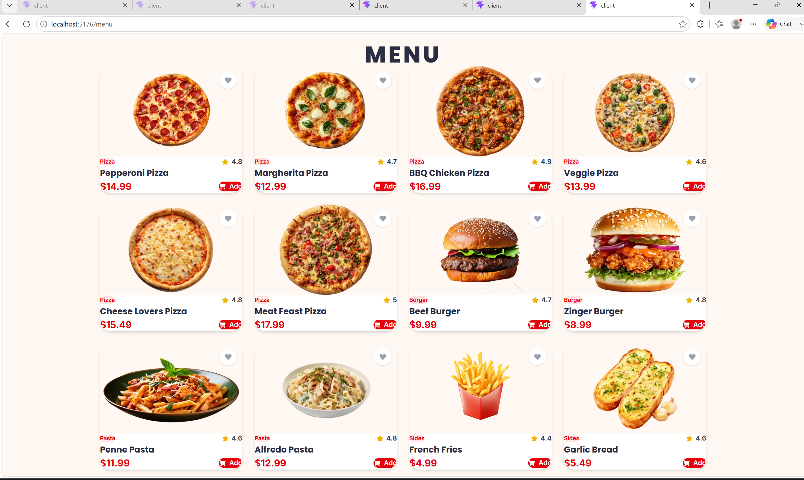
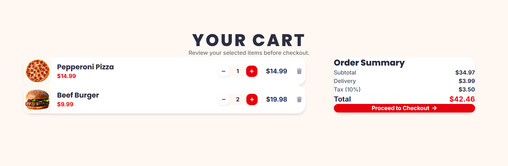
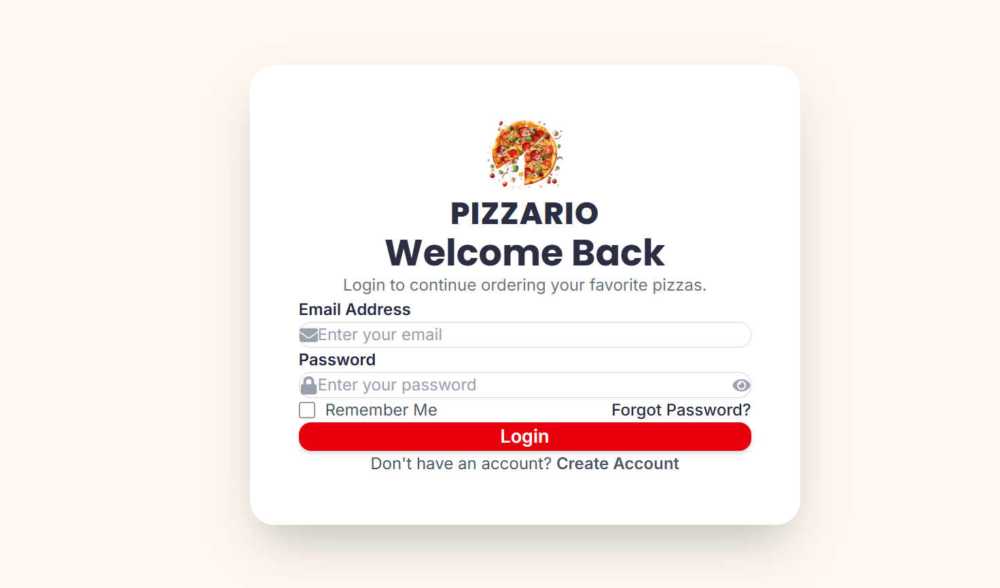
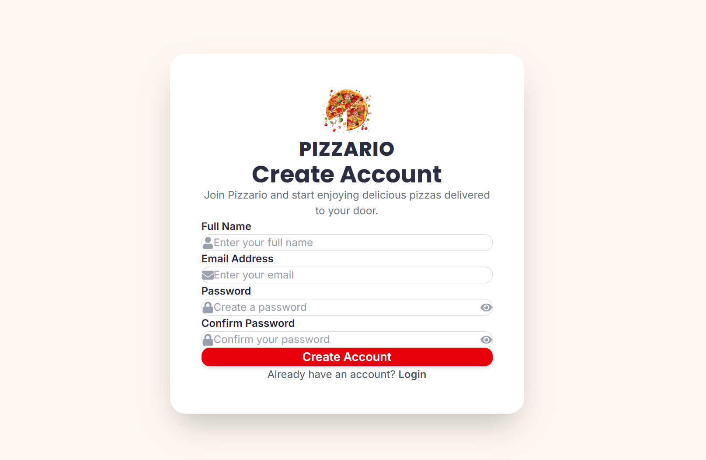
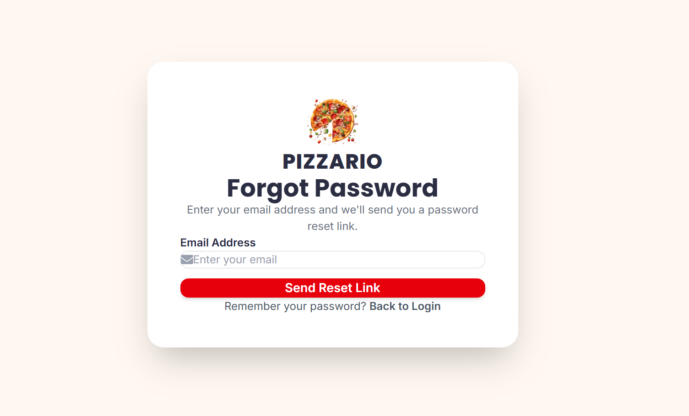

# Pizzario – Full Stack Pizza Delivery Application

Pizzario is a full-stack pizza delivery web application developed using the MERN stack. The application provides a modern and responsive user interface where users can browse the menu, register an account, log in securely, manage their cart, and proceed to checkout.

This project was built to demonstrate full-stack web development skills using React, Node.js, Express.js, and MongoDB.

---

## Features

### User Authentication
- User registration
- User login
- Password hashing with bcrypt
- JWT-based authentication
- MongoDB user storage

### Customer Features
- Responsive home page
- Pizza menu
- Shopping cart
- Checkout page
- Forgot password interface
- Responsive navigation
- Modern UI built with Tailwind CSS

### Backend
- RESTful API with Express.js
- MongoDB Atlas integration
- Mongoose models
- Authentication APIs
- Environment variable configuration

---

## Technologies Used

### Frontend
- React
- Vite
- Tailwind CSS
- React Router DOM
- React Icons

### Backend
- Node.js
- Express.js
- MongoDB Atlas
- Mongoose
- JSON Web Token (JWT)
- bcrypt
- dotenv

---

## Project Structure

```text
PizzaDeliveryApplication
│
├── client
│   ├── src
│   ├── assets
│   ├── components
│   └── pages
│
├── server
│   ├── config
│   ├── controllers
│   ├── models
│   ├── routes
│   └── server.js
│
├── screenshots
└── README.md
```

---

## Screenshots

### Home Page

.png)

### Why Choose Us

.png)

### Signature Pizzas

.png)

### Menu



### Shopping Cart



### Login



### Register



### Forgot Password



### Reset Password


---

## Installation

### Clone the repository

```bash
git clone https://github.com/areeshakhan05/Pizza-Delivery-Application-Pizzario.git
```

### Client

```bash
cd client
npm install
npm run dev
```

### Server

```bash
cd server
npm install
npm run dev
```

---

## Environment Variables

Create a `.env` file inside the `server` directory.

```env
PORT=5000
MONGODB_URI=YOUR_MONGODB_URI
JWT_SECRET=YOUR_SECRET_KEY
```

---

## Future Improvements

- Order history
- Online payment integration
- Admin dashboard
- Order tracking
- User profile management

---

## Author

**Areesha Khan**

BS Computer Science Student  
Aspiring Full-Stack Developer

---

## License

This project was developed for educational and portfolio purposes.
